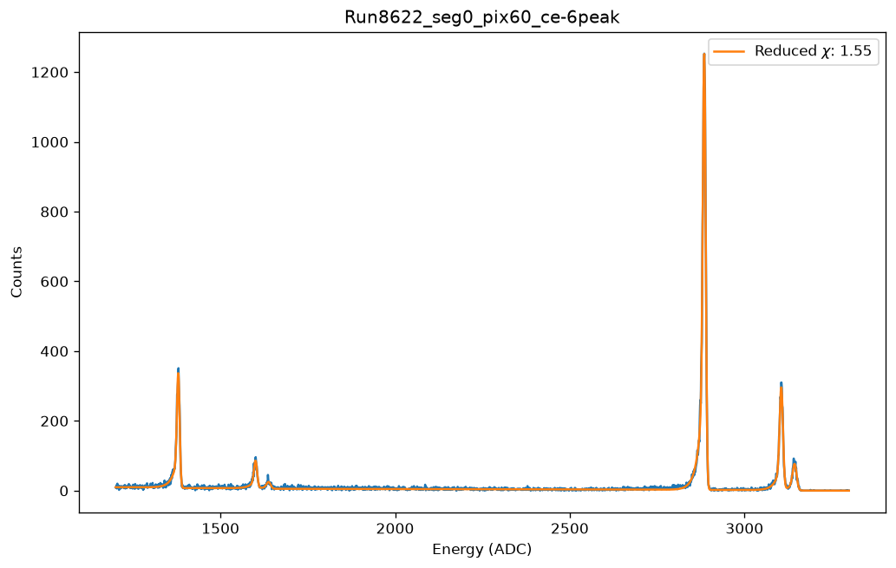
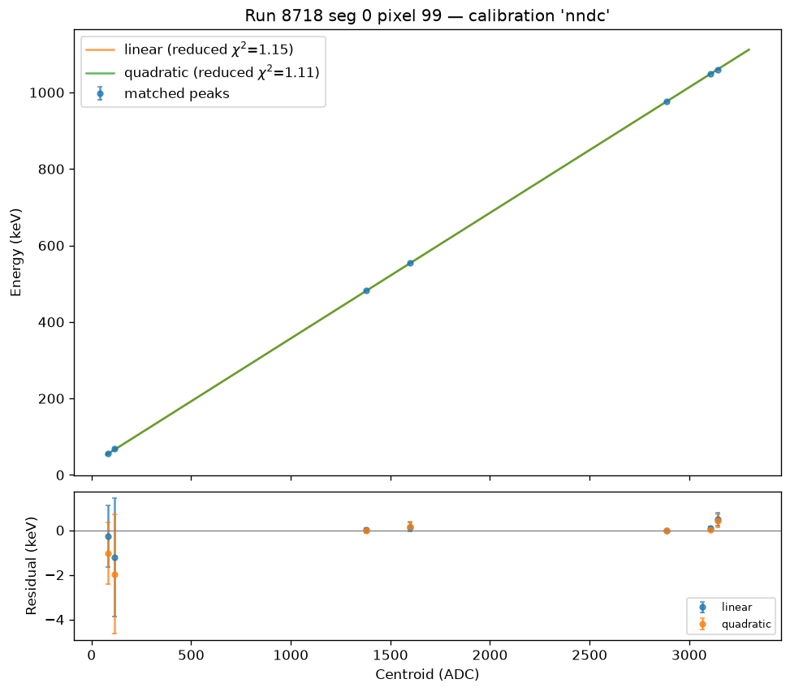
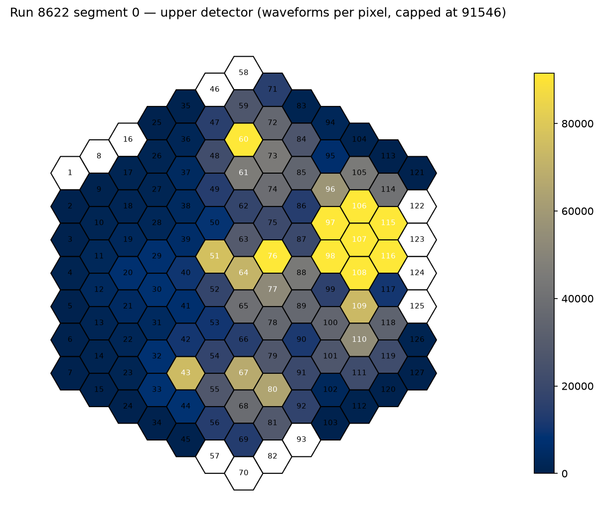
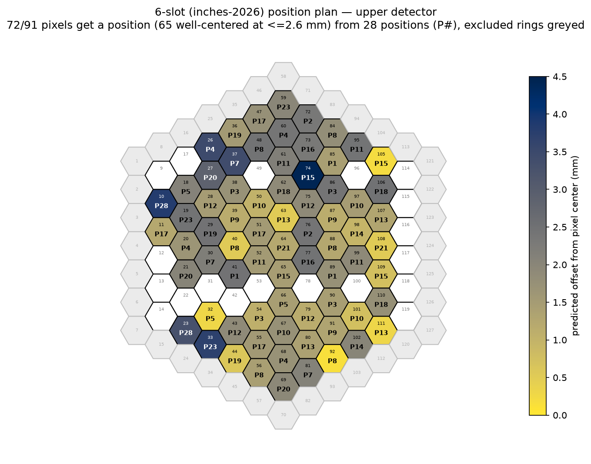

# Example outputs

One representative figure per pipeline stage, with the exact command
that regenerates it. All live figures land in `fit_plots/`, `hitmaps/`,
or `plans/` (gitignored, regenerable); these copies are committed so the
documentation stands alone.

## Spectrum fit (scripts/fit_spectra.py)



```bash
python scripts/fit_spectra.py --run 8622 --pixels 60 --plot fit_plots/
```

The Bi-207 "ce-6peak" recipe on run 8622 pixel 60: all six CE lines
(482/554/566 and 976/1048/1060 keV) fitted simultaneously over the
1200–3300 ADC window, reduced chi2 1.55. The fitted parameters, errors,
covariance, and the exact inputs are stored in spectrum_fits
(docs/fit_storage.md); each pixel also gets an "auger-2peak" fit of the
low-energy window. A companion figure per fit is written when `--plot`
is given.

## Calibration (scripts/calibrate.py)



```bash
python scripts/calibrate.py --run 8718 --pixels 99 --plot fit_plots/
```

Run 8718 pixel 99: the matched ADC peaks against their NNDC energies,
the weighted linear and quadratic fits (coefficients in keV, keV/ADC,
keV/ADC²; `scale_covar=False` — see docs/fit_storage.md), and the
residual panel in keV. This pixel has 7 points, not 8: its garbage
"CE 566" peak was refused at extraction (two-anchor validation), so the
calibration never saw it.

## Hit map (scripts/show_hitmap.py)



```bash
python scripts/show_hitmap.py 8622 --det upper
```

Waveform counts per pixel for one run segment, straight from the stored
trap filter outputs (array lengths only — no energy arrays are pulled),
drawn in the collaboration's standard style (cividis, mirrored lower
detector, color scale capped at the 93rd percentile so the hottest
source pixels don't crush the rest). This is the view used to verify
source positions by eye — the anchor identifications in
calibrationnet/positions.py came from maps like this one.

## Position plan coverage map (scripts/optimal_positions.py)



```bash
python scripts/optimal_positions.py --runs 9402 --tag 137A \
    --exclude-rings 6 --min-gain 3 --must-include ...
```

The 137 A position plan for the upper detector: each covered pixel is
labeled with the plan position (P#) that best centers it and colored by
the predicted source-to-pixel-center offset (bright = well centered,
scale in mm); white pixels are unreachable within the stage's motion
limits; grey pixels were excluded by ring. The plan CSVs alongside it in
`plans/` are what the run automation consumes
(docs/position_planning.md).
